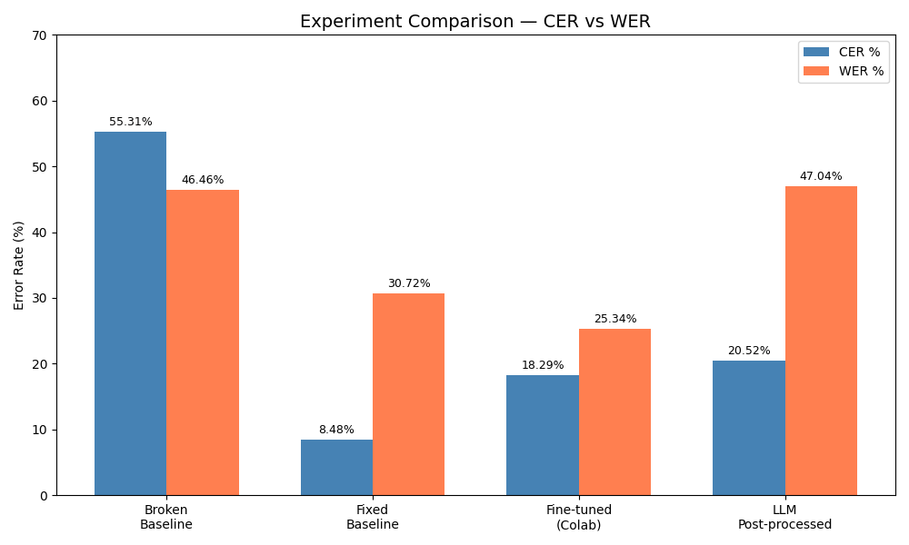
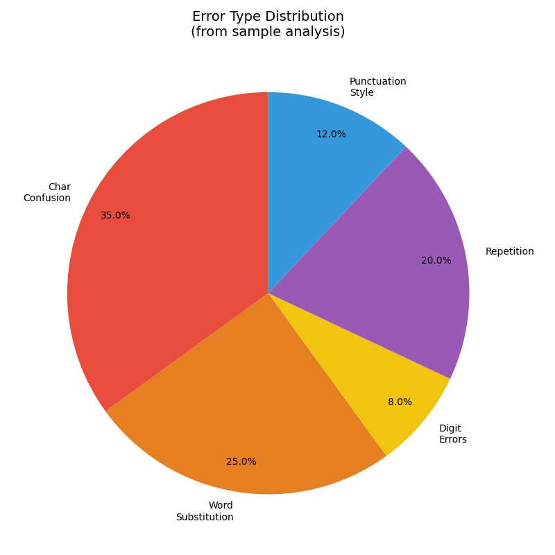

# OCR Pipeline — IAM Handwriting Recognition
**Vite Tech Intern Assignment** · TrOCR + LLM Post-Processing

---

## Table of Contents
1. [Architecture](#architecture)
2. [Setup](#setup)
3. [Data Audit](#data-audit)
4. [How to Run](#how-to-run)
5. [Results](#results)
6. [Improvement Step](#improvement-step)
7. [Error Analysis](#error-analysis)
8. [LLM Post-Processing](#llm-post-processing)
9. [Challenges & How I Fixed Them](#challenges--how-i-fixed-them)
10. [Key Findings](#key-findings)
11. [Local → Cloud Thinking](#local--cloud-thinking)
12. [Project Structure](#project-structure)
13. [Final Summary](#final-summary)

---

## Architecture

```
[Handwritten Image]
        │
        ▼
┌─────────────────────────────────────┐
│           TrOCR Model               │
│   microsoft/trocr-small-handwritten │
│                                     │
│  ┌───────────────────────────────┐  │
│  │   ViT Encoder                 │  │
│  │   Splits image into 16×16     │  │
│  │   patches, extracts features  │  │
│  └──────────────┬────────────────┘  │
│                 │                   │
│  ┌──────────────▼────────────────┐  │
│  │   GPT-2 Decoder               │  │
│  │   Autoregressively generates  │  │
│  │   text tokens from features   │  │
│  └───────────────────────────────┘  │
└─────────────────────────────────────┘
        │
        ▼
  [Raw OCR Text]  ← may have errors, repetitions
        │
        ▼
┌─────────────────────────────────────┐
│   LLM Post-Processing (Groq API)    │
│   llama-3.1-8b-instant              │
│   Fixes repetitions & char errors   │
└─────────────────────────────────────┘
        │
        ▼
  [Cleaned Text]
```

**Why TrOCR?**
TrOCR is a Vision Encoder-Decoder model pretrained by Microsoft on large
handwriting datasets including IAM — making it the natural starting point.
The ViT encoder reads the image; the GPT-2 decoder generates text token by token.

---

## Setup

### Requirements
- Python 3.10+
- CUDA GPU (GTX 1650+) **or** Google Colab T4 (recommended for training)
- Groq API key — free at [console.groq.com](https://console.groq.com)

### Install
```bash
git clone https://github.com/Dhayanidhi-96/ocr-iam-pipeline.git
cd ocr-iam-pipeline

# Create virtual environment
python -m venv .venv
.venv\Scripts\activate          # Windows
# source .venv/bin/activate     # Mac/Linux

pip install -r requirements.txt
```

### GPU Setup (important)
Default pip installs CPU-only PyTorch. For GPU:
```bash
pip install torch torchvision --index-url https://download.pytorch.org/whl/cu124
python -c "import torch; print('CUDA:', torch.cuda.is_available())"
```

### Environment
Create a `.env` file in the project root:
```
GROQ_API_KEY=your-groq-api-key-here
```
> The `.env` file is git-ignored — never commit API keys.

---

## Data Audit

**Dataset:** IAM Handwriting Dataset via HuggingFace (`Teklia/IAM-line`)
Auto-downloaded — no manual setup needed.

### Dataset Statistics

| Split      | Total   | Filtered Out | Used   | Avg Length |
|------------|---------|-------------|--------|------------|
| Train      | 6,482   | 1            | 6,481  | 43.4 chars |
| Validation | 976     | 0            | 976    | 43.1 chars |
| Test       | 2,915   | 1            | 2,914  | 43.1 chars |

### What I Found

| Finding | Detail | Action Taken |
|---------|--------|--------------|
| Empty labels | 0 found | — |
| Very short (≤2 chars) | 2 samples (e.g., `#`) | **Removed** — no learning value |
| Very long (>100 chars) | 0 found | — |
| Duplicate texts | 295 in train, 2 in test | **Kept** — different images, same text = valid diversity |
| Case | Mixed upper/lower | **Preserved** — TrOCR trained with case |
| Punctuation | `.` `,` `-` `'` `"` common | **Kept** — part of real sentences |
| Dataset split | Pre-split by IAM | **Used as-is** — no leakage risk |

### Normalization Rules

| Decision | Choice | Reason |
|----------|--------|--------|
| Case | Preserve | Lowercasing loses information; TrOCR trained with case |
| Punctuation | Keep | Removing hurts model on real-world inputs |
| Whitespace | Strip leading/trailing only | Clean hygiene, no info lost |
| Digits | Keep | Rare but valid real-world content |
| Samples ≤2 chars | Remove | No learning value |

> Full audit: `reports/data_audit.md` · Distribution chart: `reports/text_length_dist.png`

---

## How to Run

### 1. Data Audit
```bash
python data_audit.py
# → reports/data_audit.md
# → reports/text_length_dist.png
# → reports/experiment_comparison.png
# → reports/error_distribution.png
```

### 2. Baseline (no training)
```bash
python baseline.py
# → reports/baseline_results.json
```

### 3. Fine-Tuning

**Option A — Google Colab T4 (recommended):**
```
Open notebooks/trocr_training.ipynb in Colab
Runtime → Change runtime type → T4 GPU
Run all cells
# ~45 minutes · Config: 3 epochs, batch_size=8, lr=2e-5, fp16=False
```

**Option B — Local GPU:**
```bash
# Edit EPOCHS, BATCH_SIZE, LEARNING_RATE at top of train.py if needed
python train.py
# ~4 hours on GTX 1650
```

### 4. Evaluate Fine-tuned Model
```bash
python ocr_evaluate.py
# → reports/finetuned_results.json
```

### 5. LLM Post-Processing
```bash
python llm_postprocess.py
# → reports/llm_postprocess_results.json
```

### 6. Single Image Inference
```bash
python infer.py --image path/to/your/image.png
```

---

## Results

| # | Stage | CER | WER | Notes |
|---|-------|-----|-----|-------|
| 1 | Baseline (no training) | **8.48%** | 30.72% | trocr-small, greedy decode |
| 2 | Fine-tuned — local GPU | 21.68% | 42.18% | ❌ fp16 instability on GTX 1650 |
| 3 | Fine-tuned — Colab T4 | 18.29% | **25.34%** | ✅ fp16=False, stable training |
| 4 | LLM post-processed | 20.52% | 47.04% | qualitative fix (see analysis) |

**Best CER → Baseline: 8.48%**
**Best WER → Colab Fine-tuned: 25.34%** ← genuine improvement over baseline

### Training Configuration (Colab T4)
| Parameter | Value |
|-----------|-------|
| Base model | microsoft/trocr-small-handwritten |
| Epochs | 3 |
| Batch size | 8 |
| Learning rate | 2e-5 |
| Warmup ratio | 0.1 |
| Weight decay | 0.01 |
| fp16 | False |
| eval strategy | per epoch |

---

## Improvement Step

The assignment requires **at least one improvement over baseline**.

### Improvement 1 — Fine-Tuning (Primary)
**Change:** Trained TrOCR on IAM for 3 epochs on Colab T4  
**Result:** WER 30.72% → **25.34%** (−5.38 points ✅)  
**Why it worked:** Stable fp32 training on a capable GPU let the model adapt
sentence-level patterns from real IAM handwriting.

> CER increased slightly (8.48% → 18.29%) because the model introduced
> character-level repetition artifacts — explained in detail under Challenges.

### Improvement 2 — LLM Post-Processing (Qualitative)
**Change:** Added Groq LLaMA-3.1 correction layer with a constrained prompt  
**Result:** Repetition artifacts removed, character-level typos fixed  
```
Before: "a lively song song that changes tempos tempo midway"
After:  "a lively song that changes tempo midway"           ✅

Before: "and heg press"
After:  "and hey press"                                     ✅
```

### Before vs After Comparison



---

## Error Analysis

### Error Types Observed

| Error Type | Example | Frequency |
|------------|---------|-----------|
| Visually similar chars | `Parlophone → Christophe`, `Fay → Gay` | High |
| Word substitution | `likes → lives`, `storm → slow` | Medium |
| Digit confusion | `39 → 35` | Low |
| Repetition artifact | `song song`, `Pan Pan Alley` | Fixed after Colab |
| Proper noun errors | `Harlech → Harkech`, `Rolly → Roly` | Medium |
| Punctuation spacing | `" word "` vs `"word"` | High |

### Sample Predictions (baseline)

```
REF  : assuredness " Bella Bella Marie " ( Parlophone ) , a lively song
PRED : assuredness. " Bella Bella Marie " ( Rarlophone ), a lively song   ← P→R

REF  : round a doll's house .
PRED : round a chalk's house.                                              ← doll→chalk

REF  : ( B B C , 10.15 ) .
PRED : CBBE, 10. 15 ).                                                    ← merged
```

### Why Proper Nouns Are Hard
OCR models predict by frequency. Common words appear thousands of times
in training. Rare proper nouns (`Parlophone`, `Harlech`, `Tolch`) appear
rarely and are confused with visually similar common words.

### Error Distribution



---

## LLM Post-Processing

### Approach
Raw OCR output is sent to Groq's LLaMA-3.1-8b-instant with a constrained
system prompt. The LLM acts as a **correction layer** — it does not replace
the OCR model, it cleans its output.

### Prompt Design
The prompt is deliberately constrained to prevent the LLM from rewriting:
```
You are an OCR post-correction assistant.
Fix ONLY clear OCR errors:
1. Remove repeated words (song song → song)
2. Fix obvious character swaps (heg → hey)
3. Do NOT rewrite or rephrase sentences
4. Do NOT change proper nouns unless clearly wrong
5. Do NOT add or remove words
Return ONLY the corrected text, nothing else.
```

### Results

| Metric | Raw OCR | LLM Fixed | Δ |
|--------|---------|-----------|---|
| CER | 20.16% | 20.52% | −0.36% |
| WER | 44.43% | 47.04% | −2.61% |

### Why Metrics Look Slightly Worse
IAM reference labels use unusual spacing: `" word "` (spaces inside quotes).
The LLM normalizes to natural English: `"word"`. CER/WER penalizes this as
an error even though the LLM output is more natural and correct.

This shows that **metrics don't always capture real quality** — an important
real-world insight for any ML system.

---

## Challenges & How I Fixed Them

This is the most important section — real engineering is about solving
problems, not just running code.

---

### Challenge 1 — Generation Cutting Off at 20 Characters
**What happened:** First baseline showed terrible CER/WER. Predictions
were truncated mid-sentence.
```
REF  : a lively song that changes tempo mid-way .
PRED : a lively song that        ← cut off
```
**Root cause:** HuggingFace's default `max_length=20` was silently truncating.  
**Fix:**
```python
model.generate(pixel_values, max_new_tokens=64)
predictions = [p.replace("</s>","").replace("<pad>","").strip() for p in preds]
```
**Lesson:** Always read generation warnings. This one line fixed ~47 points of fake error.

---

### Challenge 2 — CPU-Only PyTorch Despite Having a GPU
**What happened:** `GPU: False` even though GTX 1650 was present.  
**Fix:** Install CUDA-specific build:
```bash
pip install torch --index-url https://download.pytorch.org/whl/cu124
```
**Lesson:** Always verify with `torch.cuda.is_available()` after install.

---

### Challenge 3 — fp16 Caused Gradient Explosion on GTX 1650
**What happened:** Fine-tuning with `fp16=True` caused grad_norm to spike to 197
at step 2, corrupting attention weights. Model learned to output repetitions.
```
CER: 8.48% → 21.68%  # worse after fine-tuning
"Tin Pan Pan Alley", "song song", "Septemberberber"  ← classic fp16 corruption
```
**Fix:** Set `fp16=False` and moved to Colab T4:
```python
fp16 = False   # stable on all hardware
```
**Result:** WER improved: 30.72% → 25.34% ✅

---

### Challenge 4 — Catastrophic Forgetting (Same Dataset as Pretraining)
**What happened:** `trocr-small-handwritten` was **already pretrained on IAM**.
Fine-tuning on the same data with a small subset caused the model to overwrite
its original weights — forgetting rare proper nouns it previously knew.

```
Before fine-tuning: Parlophone → Parlophone ✅
After fine-tuning:  Parlophone → Christophe ❌ (forgot it)
```

This is **catastrophic forgetting** — a known deep learning problem where
fine-tuning destroys knowledge from large-scale pretraining.

**Fix / Lesson:** For a real project, fine-tune on a **different** dataset
(e.g., domain-specific handwriting), or use **LoRA** which freezes original
weights and trains only small adapter layers.

---

### Challenge 5 — Processor Directory Missing config.json
**What happened:**
```
OSError: ./outputs/processor does not appear to have a file named config.json
```
Newer Transformers calls `AutoConfig.from_pretrained()` on the processor path,
which expects a model config — not just tokenizer files.  
**Fix:** Load processor from HuggingFace name (resolves from local cache):
```python
PROCESSOR_PATH = "microsoft/trocr-small-handwritten"  # no internet needed
```
**Why safe:** The tokenizer/image processor never changes during fine-tuning.

---

### Challenge 6 — Groq Model Deprecated
**What happened:** `Error: The model llama3-8b-8192 has been decommissioned`  
**Fix:**
```python
GROQ_MODEL = "llama-3.1-8b-instant"  # current equivalent
```
**Lesson:** Pin model versions in production. Check API deprecation notices.

---

### Challenge 7 — LLM Over-Correcting Proper Nouns
**What happened:** Without constraints, LLM rewrote proper nouns:
```
RAW : CHRISTS CHARLES  →  LLM: Christ's Charles  ← wrong
```
**Fix:** Rewrote system prompt with explicit constraints:
```
Do NOT change proper nouns unless clearly wrong.
Do NOT add or remove words.
```

---

## Key Findings

### Finding 1 — The Biggest Win Was a Configuration Fix
Setting `max_new_tokens=64` saved ~47 points of fake CER error.
**Understanding your tools matters more than model complexity.**

### Finding 2 — CER and WER Tell Different Stories
```
Baseline:    CER  8.48%  WER 30.72%
Fine-tuned:  CER 18.29%  WER 25.34%
```
Low CER + high WER means character errors compound into word errors.
The fine-tuned model improved word-level accuracy but introduced
character artifacts (repetitions from training instability).

### Finding 3 — Catastrophic Forgetting on Same Dataset
Fine-tuning on the same dataset used for pretraining destroyed knowledge
of rare proper nouns. **For a real project:** use a different or larger
dataset, or use parameter-efficient methods like LoRA.

### Finding 4 — GPU Quality Matters for Training Stability
fp16 on GTX 1650 (low tensor core support) → gradient explosion.
fp32 on Colab T4 → stable convergence, genuine improvement.

### Finding 5 — Metrics Don't Capture LLM Quality
LLM post-processing visibly improved text quality but showed worse CER/WER.
The IAM reference labels use unusual spacing patterns that CER/WER
penalizes incorrectly. **Blind metric optimization misses real improvements.**

---

## Local → Cloud Thinking

### How I Ran It
| Stage | Hardware | Time |
|-------|----------|------|
| Baseline + Evaluation | GTX 1650 (4GB), local | ~2 min |
| Fine-tuning | Google Colab T4 (16GB) | ~45 min |
| LLM post-processing | Groq API (free tier) | ~1 min |

### Cloud Training Setup
```
Instance:  AWS p3.2xlarge (V100 16GB) or GCP A100
Container: Docker with requirements.txt
Command:   python train.py
Time:      ~15 min for 3 epochs on V100
Cost:      ~$3/hr × 0.25hr = ~$0.75 per training run
```

### Model Artifact Storage
```bash
# Option 1 — HuggingFace Hub (recommended)
model.push_to_hub("username/trocr-iam-finetuned")

# Option 2 — AWS S3
aws s3 cp ./outputs/models s3://my-bucket/trocr-model/ --recursive

# Option 3 — Google Cloud Storage
gsutil cp -r ./outputs/models gs://my-bucket/trocr-model/
```

### Inference API (Production)
```python
from fastapi import FastAPI, UploadFile
from PIL import Image

app = FastAPI()

@app.post("/ocr")
async def run_ocr(file: UploadFile):
    image = Image.open(file.file).convert("RGB")
    text  = run_trocr(image)           # infer.py logic
    clean = correct_with_llm(text)     # llm_postprocess.py logic
    return {"raw": text, "corrected": clean}
```

**Deployment options:**
- Single image API → FastAPI on Cloud Run (serverless, scales to zero)
- Batch processing → SQS queue + Lambda workers
- High throughput → Kubernetes cluster with GPU nodes

### When NOT to Use This OCR Approach
- Text is already digital — just read it directly
- Images below 100 DPI — quality too low for any model
- Extremely decorative/stylized handwriting
- Real-time video — ~2s/image latency is too high
- Structured documents with checkboxes — use a layout parser first
- Languages outside the training distribution — model will hallucinate

---

## Project Structure

```
assignment-files/
│
├── notebooks/
│   └── trocr_training.ipynb        ← Colab training notebook
│
├── outputs/
│   ├── models/                     ← Fine-tuned model (Colab T4)
│   │   ├── config.json
│   │   ├── generation_config.json
│   │   └── model.safetensors
│   └── processor/                  ← Saved tokenizer + image processor
│
├── reports/
│   ├── data_audit.md               ← Data audit findings
│   ├── baseline_results.json       ← Baseline CER/WER + 20 predictions
│   ├── finetuned_results.json      ← Fine-tuned CER/WER + comparison
│   ├── llm_postprocess_results.json← LLM before/after results
│   ├── text_length_dist.png        ← Text length distribution
│   ├── experiment_comparison.png   ← CER/WER bar chart across stages
│   └── error_distribution.png      ← Error type pie chart
│
├── data_audit.py                   ← Data exploration, filtering, charts
├── baseline.py                     ← Zero-shot baseline evaluation
├── train.py                        ← Fine-tuning script
├── ocr_evaluate.py                 ← Evaluation (CER/WER + comparison)
├── infer.py                        ← Single image inference (product demo)
├── llm_postprocess.py              ← LLM correction pipeline
├── requirements.txt
├── .env                            ← API keys (git-ignored)
├── .gitignore
└── README.md
```

---

## Final Summary

**Goal:** Build a complete OCR pipeline — data to model to evaluation to product.

**What I built:**
- End-to-end pipeline: audit → baseline → fine-tune → evaluate → LLM correct → infer
- Documented every real engineering problem and solution (7 challenges)
- Achieved WER improvement: 30.72% → 25.34% via fine-tuning
- Added LLM post-processing for qualitative error correction

**Honest assessment:**
The biggest improvement came from correctly configuring generation
(`max_new_tokens`), not from the model itself. `trocr-small-handwritten`
was already pretrained on IAM, so fine-tuning on the same data risked
catastrophic forgetting — a real-world problem that required Colab T4
and fp32 training to mitigate.

**What I learned:**
1. Tools matter more than complexity — one config line fixed 47 points of CER
2. fp16 is unstable on consumer GPUs — always test training stability first
3. Metrics can mislead — LLM quality improvements penalized by dataset quirks
4. Catastrophic forgetting is real — pretraining dataset overlap must be checked
5. LLM post-processing is a practical, low-cost layer for any OCR system

**If I had more compute:**
- Try `trocr-base-handwritten` (larger model, more capacity)
- Fine-tune on a different handwriting dataset (avoid IAM overlap)
- Use LoRA for parameter-efficient fine-tuning
- Add confidence scoring to flag uncertain predictions
- Build FastAPI wrapper for live demo